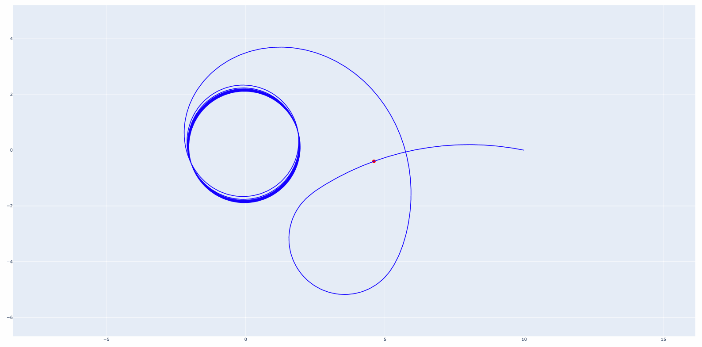
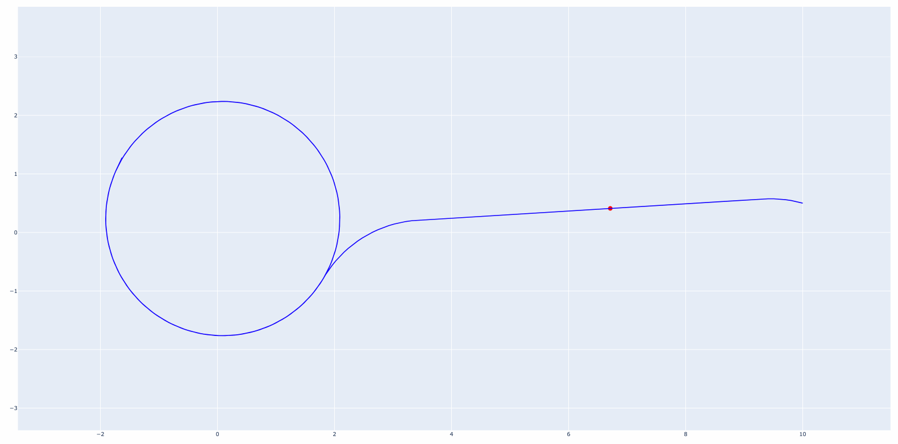
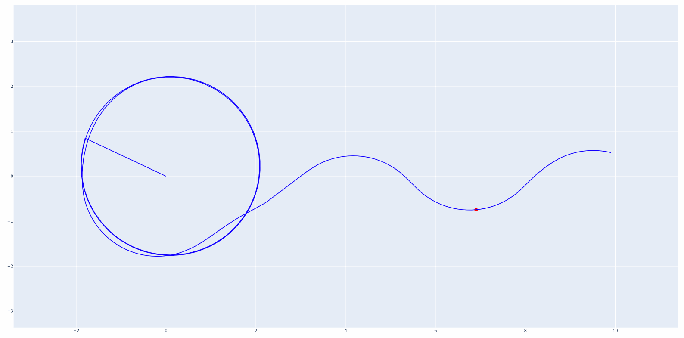

# About

`dubins` is a library for control of a highly-constrained Dubins vehicle as implemented in [Pydrake](https://drake.mit.edu/), a Python model-based design and verification tool for robots. This is my final project for the MIT course [6.832: Underactuated Robotics](http://underactuated.csail.mit.edu/Spring2021/). To complete this project, I combined the notion of a [control-Lyapunov Function](https://en.wikipedia.org/wiki/Control-Lyapunov_function) and [trajectory optimization](http://underactuated.csail.mit.edu/trajopt.html) to control the long-term behavior of a highly constrained system in the presence of trajectory disturbances.

My implementation, while not perfect, marks a drastic improvement over the optimal controller when trajectory disturbances are present. For more information and analysis, please read my [term paper](https://github.com/deliastephens/dubins/blob/main/6_832_Final_Report.pdf).

The repository contains:

1. Lyapunov Control - functions for applying a Control Lyapunov Function (CLF) to our system.
2. Trajectory Optimization - functions for creating a PyDrake `MathematicalProgram` that navigates the Dubins vehicle to a desired start and end state.
3. mCLF - a custom algorithm for robust trajectory optimization, combining the concepts of a CLF with trajectory optimization to control the systme in the presence of disturbances.
4. Miscellaneous visualization tools, which were useful in writing my final report.


# Use
Explore the `demo.ipynb` Jupyter notebook for examples (and visualizations) of how this code can work!

## Miscellaneous Warnings
This code is not entirely finished. It was completed for a term project; many variables are hard-coded into my code, and the function library is not entirely clear. If you want to modify this library, please do so! I welcome any and all contributions.

## Lyapunov Controller


## Optimal Controller


## Robust Controller


# Installation Guide
First, clone this repository.
```
git clone https://github.com/deliastephens/dubins.git
```

`dubins` builds on the PyDrake libraries, which can be installed via [these instructions](http://underactuated.csail.mit.edu/drake.html). On my machine, I have to run the following in the `dubins` directory after downloading the binaries, unpacking, and setting up my PYTHONPATH. PyDrake is not compatible with Anaconda, so make sure to deactivate your conda environments before installation!


```
./install_prereqs.sh
pip3.9 install --requirement /opt/drake/share/drake/setup/requirements.txt --requirement requirements.txt
export PYTHONPATH=`pwd`:${PYTHONPATH}
```

If required, a manual `pip` install of `numpy` and `matplotlib` may be required.


To activate a Python virtualenvironment, 
```
source venv/bin/activate
```

Finally, this project is best viewed through the wonderful lens of a [Jupyter notebook](https://jupyter.org/install). To start a Jupyter notebook, simply run
```
jupyter notebook
```

If you change any of the files, you must restart the kernel.

# References

\[1\]  T. Maillot,  U. Boscain, J.-P. Gauthier, and U. Serres, “Lyapunov and minimum-time path planning for drones,” Jul. 2013. \[Online\]. Available:https://hal.archives-ouvertes.fr/hal-00847812

\[2\]  B.Paden, M. Cap, S.Z. Yong, D. Yershov, and E. Frazzoli, “A Survey of Motion Planning and Control  Techniques for Self-driving Urban Vehicles, ”arXiv:1604.07446 [cs], Apr. 2016, arXiv: 1604.07446. \[Online\]. Available: http://arxiv.org/abs/1604.07446

\[3\] Russ Tedrake. Underactuated Robotics: Algorithms for Walking, Running, Swimming, Flying, and Manipulation (Course Notes for MIT 6.832). Downloaded on 19 May 2021 from http://underactuated.mit.edu/

